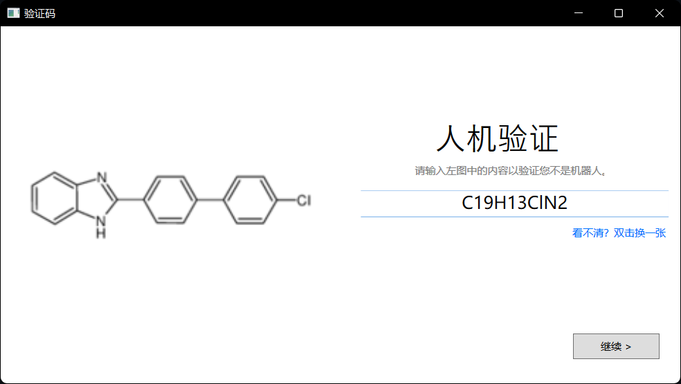

# CheCaptcha
防止您的服务被不懂化学的人访问！


## 🍗 如何食用


1. 克隆仓库。

    ```
    git clone https://github.com/Aurorabili/CheCaptcha.git
    cd CheCaptcha
    ```

2. 安装依赖。

    ```
    pip install -r requirements.txt
    ```

3. 立刻开始！
    ```
    python3 main.py
    ```

## 🎯 样例参考

```json
GET /api/checaptcha HTTP/1.1

{
    "code": 200,
    "data": {
        "imgurl": "https://p0.molbase.net/molpic/03/98/3981977.png",
        "ans": "C32H41NO4"
    }
}
```